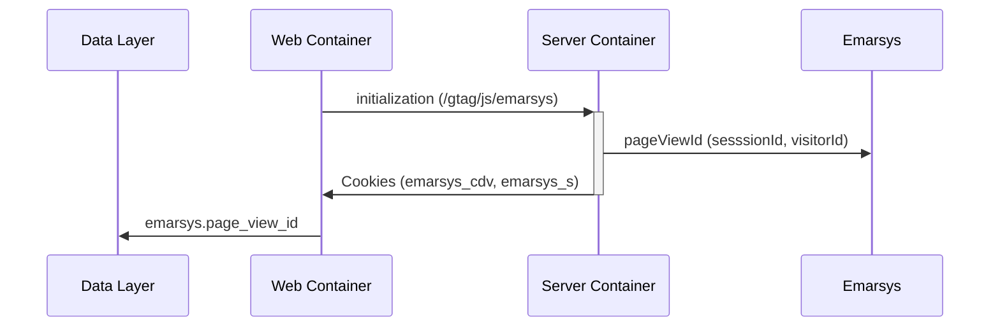
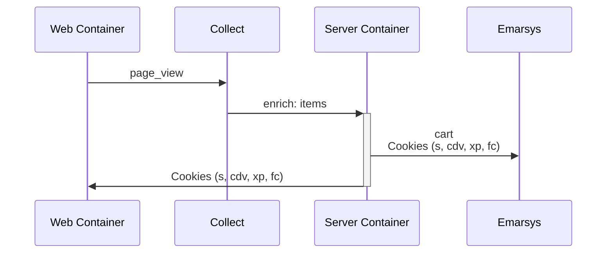
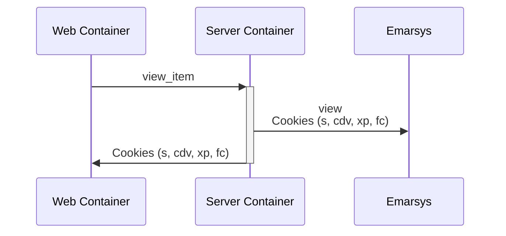
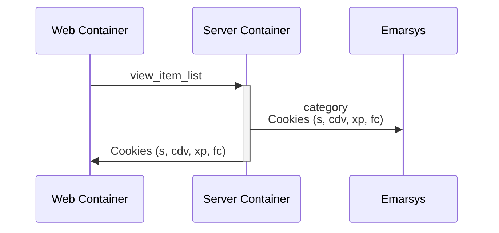
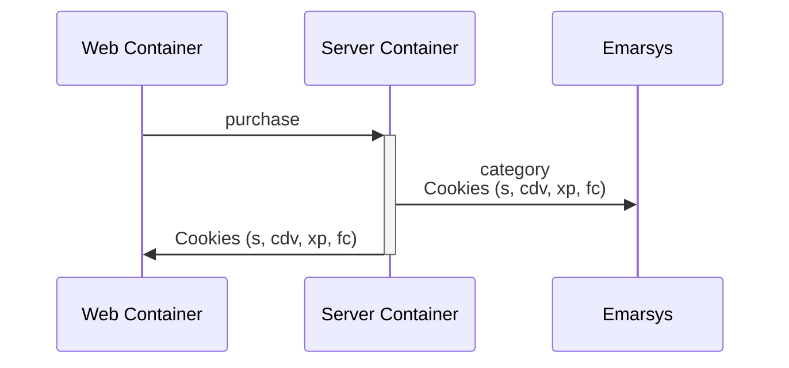

# Emarsys Web Extend

The emarsys server side web extend provider makes use of the [Web Extend Command](https://dev.emarsys.com/docs/web-extend-reference/a1a185e5fbb6b-web-extend-command-implementation).

## Initialization

Since we need to trigger multiple commands, we need to ensure we're always sending the same `sessionId`, `visitorId` & `pageViewId` for all calls.
The initialization sets the `emarsys.page_view_id` variable into the `dataLayer` to be sent with each following request.



## Commands

### Cart

NOTE: The default `page_view` event does not contain the `items` so we need to enrich them in the `collect` service.



Standard implementation

```javascript
// The usual commands to identify visitors and report cart contents.
ScarabQueue.push(['cart', [
    {item: 'item_1', price: 19.9, quantity: 1},
    {item: 'item_2', price: 29.7, quantity: 3}
]]);
// Firing the ScarabQueue. Should be the last call on the page, called only once.
ScarabQueue.push(['go']);
```

### View



Standard implementation

```javascript
// Passing on item ID to report product view. Item ID should match the value listed in the Product Catalog
ScarabQueue.push(['view', 'item_3']);
// Firing the ScarabQueue. Should be the last call on the page, called only once.
ScarabQueue.push(['go']);
```

## Category



Standard implementation

```javascript
// Passing on the category path being visited. Must match the 'category' values listed in the Product Catalog
ScarabQueue.push(['category', 'Bikes > Road Bikes']);
// Firing the ScarabQueue. Should be the last call on the page, called only once.
ScarabQueue.push(['go']);
```

## Purchase



Standard implementation

```javascript
// Passing on order details. The price values passed on here serve as the basis of our revenue and revenue contribution reports.
ScarabQueue.push(['purchase', {
    orderId: '231213',
    items: [
      {item: 'item_1', price: 19.9, quantity: 1},
      {item: 'item_2', price: 29.7, quantity: 3}
    ]
}]);
// Firing the ScarabQueue. Should be the last call on the page, called only once.
ScarabQueue.push(['go']);
```

## References

- [Web Extend Command](https://dev.emarsys.com/docs/web-extend-reference/a1a185e5fbb6b-web-extend-command-implementationhttps://dev.emarsys.com/docs/web-extend-reference/a1a185e5fbb6b-web-extend-command-implementation)
